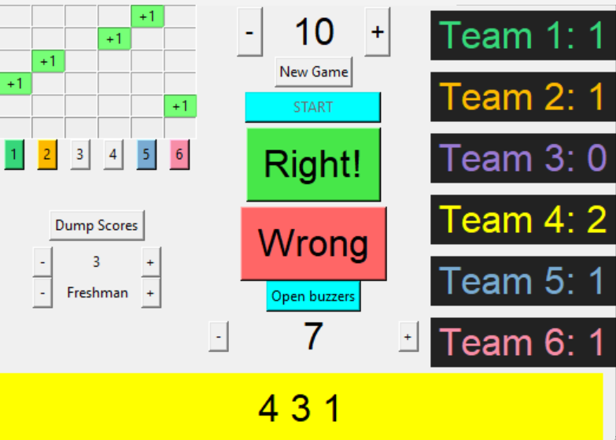

pi-bowl
=======

A Python (Tkinter, RPi.GPIO) program for running a Knowledge Bowl buzzer system from a Raspberry Pi, managing timing, scoring, buzzer lockout, and player recognition.

More specifically, this program allows a Raspberry Pi to replace a commercial buzzer hub or Pocket Box, while being magnitudes more useful  If you make your own buzzer devices (just a button closing a circuit), you can save hundreds of dollars by not purchasing a buzzer system at all. This works with traditional buzzer strips or any other buzzer device that can connect to GPIO pins.

The program interfaces directly to the Pi's IO pins.  I used a RCA cables to connect to RCA input jacks that are wired to the Raspberry Pi's GPIO pins, which all connect to the Pi's ground pin. I did not use a Pi-face, or any other Pi addon.

The program needs super user privileges to manage the IO pins.

Features in common with commercial buzzer systems include:

1. Support for six teams.

Allows for a simple clear-buzzer functionality, disconnected to any scoring or timing system.  (One would only use it in this manner when testing buzzers, or when following very different rules).
